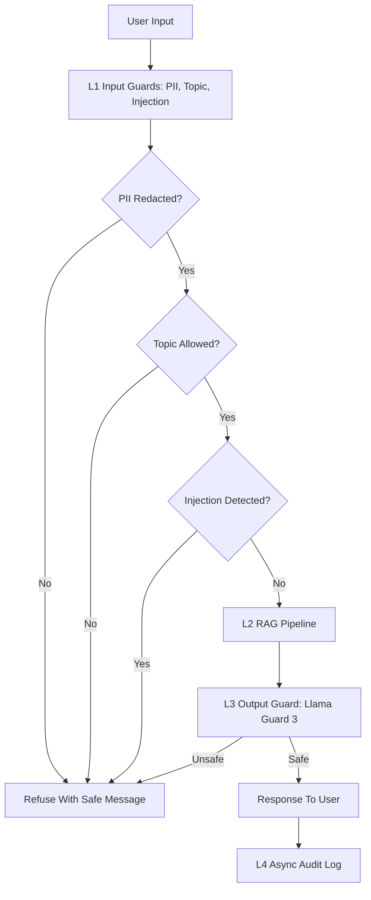

# Production Blueprint

## 1. SLO Definition

| Metric | Target | Alert Threshold | Severity |
|---|---:|---:|---|
| Faithfulness | >= 0.85 | < 0.80 for 30 min | P2 |
| Answer Relevancy | >= 0.80 | < 0.75 for 30 min | P2 |
| Context Precision | >= 0.70 | < 0.65 for 1 hour | P3 |
| Context Recall | >= 0.75 | < 0.70 for 1 hour | P3 |
| P95 Latency With Guardrails | < 2.5s | > 3.0s for 5 min | P1 |
| Guardrail Detection Rate | >= 90% | < 85% daily | P2 |
| False Positive Rate | < 5% | > 10% daily | P2 |

## 2. Architecture Diagram

Latency budget:
- L1 input layer P95 target: < 50 ms.
- L2 RAG generation P95 target: < 2.0 s.
- L3 output safety P95 target: < 100 ms.
- L4 audit logging is asynchronous and excluded from user-facing latency.

## 3. Alert Playbook

### Incident: Faithfulness Drops Below 0.80
Severity: P2.

Detection: continuous eval alert from nightly RAGAS sample or PR eval gate.

Likely causes:
1. Retriever returns stale or irrelevant chunks.
2. Prompt changed without eval approval.
3. Document corpus updated without re-indexing.

Investigation:
1. Compare context precision and recall for the same time window.
2. Diff prompt and retriever configuration against the last passing run.
3. Check corpus ingestion and embedding job logs.

Resolution:
- Re-index corpus if source documents changed.
- Roll back prompt if the regression correlates with a prompt deploy.
- Increase top_k and add reranking for multi-context failures.

### Incident: P95 Latency Exceeds 3 Seconds
Severity: P1.

Detection: production latency alert for guarded requests.

Likely causes:
1. LLM provider latency spike.
2. Output safety endpoint timeout.
3. Retrieval backend saturation.

Investigation:
1. Break down latency by L1, L2, and L3.
2. Check provider status and request retries.
3. Inspect vector database query time and queue depth.

Resolution:
- Enable cached safety decisions for repeated safe templates.
- Fail over to a lower-latency model tier for non-critical requests.
- Scale retriever replicas or reduce top_k temporarily.

### Incident: Guardrail Detection Rate Drops Below 85 Percent
Severity: P2.

Detection: scheduled adversarial regression test.

Likely causes:
1. New jailbreak pattern missing from regex or classifier examples.
2. Topic guard threshold too permissive.
3. Output guard API/model version changed.

Investigation:
1. Group missed attacks by attack type.
2. Compare results with the previous guardrail model version.
3. Review false negatives for common wording.

Resolution:
- Add missed patterns to the adversarial test suite.
- Tighten topic validation and injection checks.
- Pin output guard model version and rerun benchmark.

## 4. Monthly Cost Estimate

Assumption: 100,000 production queries per month.

| Component | Unit Cost | Volume | Monthly Cost |
|---|---:|---:|---:|
| RAG generation, GPT-4o-mini tier | $0.001/query | 100k | $100 |
| RAGAS continuous eval, 1% sample | $0.01/query | 1k | $10 |
| LLM judge, light tier | $0.001/query | 10k | $10 |
| LLM judge, high-accuracy tier | $0.05/query | 1k | $50 |
| Presidio and regex guards | Self-hosted | 100k | $0 |
| Llama Guard 3 GPU endpoint | $0.30/hour | 720 hr | $216 |
| Total |  |  | $386 |

Cost optimization:
- Use tiered judging: cheap judge for routine monitoring, stronger judge only for regressions.
- Sample 1 to 5 percent of traffic based on incident risk.
- Use API-based Llama Guard for low-volume deployments and self-host only when utilization is high.
